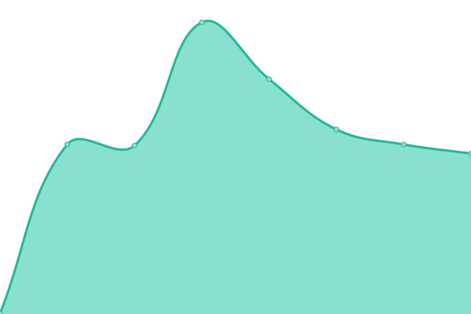

# [📈 Live Status](https://Re2Dev.github.io/Uptime-Monitor): <!--live status--> **🟩 All systems operational**

This repository contains the open-source uptime monitor and status page for [RedDev](https://about.re2dev.de/github), powered by [Upptime](https://github.com/upptime/upptime).

With [Upptime](https://upptime.js.org), you can get your own unlimited and free uptime monitor and status page, powered entirely by a GitHub repository. We use [Issues](https://github.com/Re2Dev/Uptime-Monitor/issues) as incident reports, [Actions](https://github.com/Re2Dev/Uptime-Monitor/actions) as uptime monitors, and [Pages](https://Re2Dev.github.io/Uptime-Monitor) for the status page.

<!--start: status pages-->
<!-- This summary is generated by Upptime (https://github.com/upptime/upptime) -->
<!-- Do not edit this manually, your changes will be overwritten -->
<!-- prettier-ignore -->
| URL | Status | History | Response Time | Uptime |
| --- | ------ | ------- | ------------- | ------ |
|  [Server 01 (Germany)](https://DE-01.host.re2volve.de/status) | 🟩 Up | [server-01-germany.yml](https://github.com/Re2Dev/Uptime-Monitor/commits/HEAD/history/server-01-germany.yml) | 

 575ms
     
 | 

<a href="https://Re2Dev.github.io/Uptime-Monitor/history/server-01-germany">100.00%</a>
    

|  [Server 02 (Germany)](https://DE-02.host.re2volve.de/status) | 🟩 Up | [server-02-germany.yml](https://github.com/Re2Dev/Uptime-Monitor/commits/HEAD/history/server-02-germany.yml) | 

 645ms
     
 | 

<a href="https://Re2Dev.github.io/Uptime-Monitor/history/server-02-germany">100.00%</a>
    

|  [Server 03 (Germany)](https://DE-03.host.re2volve.de/status) | 🟩 Up | [server-03-germany.yml](https://github.com/Re2Dev/Uptime-Monitor/commits/HEAD/history/server-03-germany.yml) | 

 571ms
     
 | 

<a href="https://Re2Dev.github.io/Uptime-Monitor/history/server-03-germany">100.00%</a>
    

|  [Apps](https://status.re2volve.de/api/apps) | 🟩 Up | [apps.yml](https://github.com/Re2Dev/Uptime-Monitor/commits/HEAD/history/apps.yml) | 

 544ms
     
 | 

<a href="https://Re2Dev.github.io/Uptime-Monitor/history/apps">100.00%</a>
    

|  [Pages](https://status.re2volve.de/api/pages) | 🟩 Up | [pages.yml](https://github.com/Re2Dev/Uptime-Monitor/commits/HEAD/history/pages.yml) | 

 113ms
     
 | 

<a href="https://Re2Dev.github.io/Uptime-Monitor/history/pages">100.00%</a>
    

|  [URL-Shortener](https://link.re2volve.de/status) | 🟩 Up | [url-shortener.yml](https://github.com/Re2Dev/Uptime-Monitor/commits/HEAD/history/url-shortener.yml) | 

 529ms
     
 | 

<a href="https://Re2Dev.github.io/Uptime-Monitor/history/url-shortener">100.00%</a>
    

|  [Websites](https://status.re2volve.de/api/websites) | 🟩 Up | [websites.yml](https://github.com/Re2Dev/Uptime-Monitor/commits/HEAD/history/websites.yml) | 

 112ms
     
 | 

<a href="https://Re2Dev.github.io/Uptime-Monitor/history/websites">100.00%</a>
    

|  [Auth Service](https://auth.re2volve.de/status) | 🟩 Up | [auth-service.yml](https://github.com/Re2Dev/Uptime-Monitor/commits/HEAD/history/auth-service.yml) | 

 591ms
     
 | 

<a href="https://Re2Dev.github.io/Uptime-Monitor/history/auth-service">100.00%</a>
    

|  [Download Service](https://get.re2volve.de/status) | 🟩 Up | [download-service.yml](https://github.com/Re2Dev/Uptime-Monitor/commits/HEAD/history/download-service.yml) | 

 624ms
     
 | 

<a href="https://Re2Dev.github.io/Uptime-Monitor/history/download-service">100.00%</a>
    

|  [API Service](https://api.re2volve.de/status) | 🟩 Up | [api-service.yml](https://github.com/Re2Dev/Uptime-Monitor/commits/HEAD/history/api-service.yml) | 

 555ms
     
 | 

<a href="https://Re2Dev.github.io/Uptime-Monitor/history/api-service">100.00%</a>
    

|  [RainMC](https://status.re2volve.de/api/rainmc) | 🟩 Up | [rain-mc.yml](https://github.com/Re2Dev/Uptime-Monitor/commits/HEAD/history/rain-mc.yml) | 

 115ms
     
 | 

<a href="https://Re2Dev.github.io/Uptime-Monitor/history/rain-mc">100.00%</a>
    

|  [Database](https://status.re2volve.de/api/database) | 🟩 Up | [database.yml](https://github.com/Re2Dev/Uptime-Monitor/commits/HEAD/history/database.yml) | 

 112ms
     
 | 

<a href="https://Re2Dev.github.io/Uptime-Monitor/history/database">100.00%</a>
    

<!--end: status pages-->

[**Visit our status website →**](https://Re2Dev.github.io/Uptime-Monitor)

## 📄 License

- Powered by: [Upptime](https://github.com/upptime/upptime)
- Code: [MIT](./LICENSE) © [Anand Chowdhary](https://anandchowdhary.com), supported by [Pabio](https://pabio.com)
- Data in the `./history` directory: [Open Database License](https://opendatacommons.org/licenses/odbl/1-0/)
